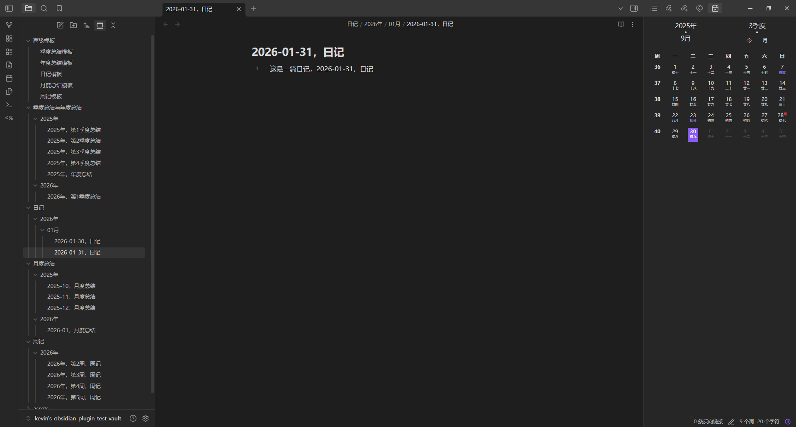
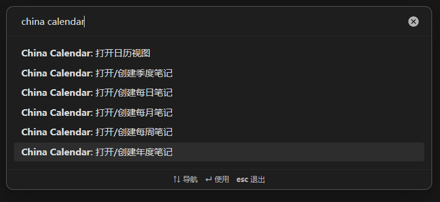
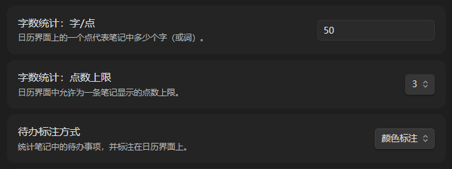
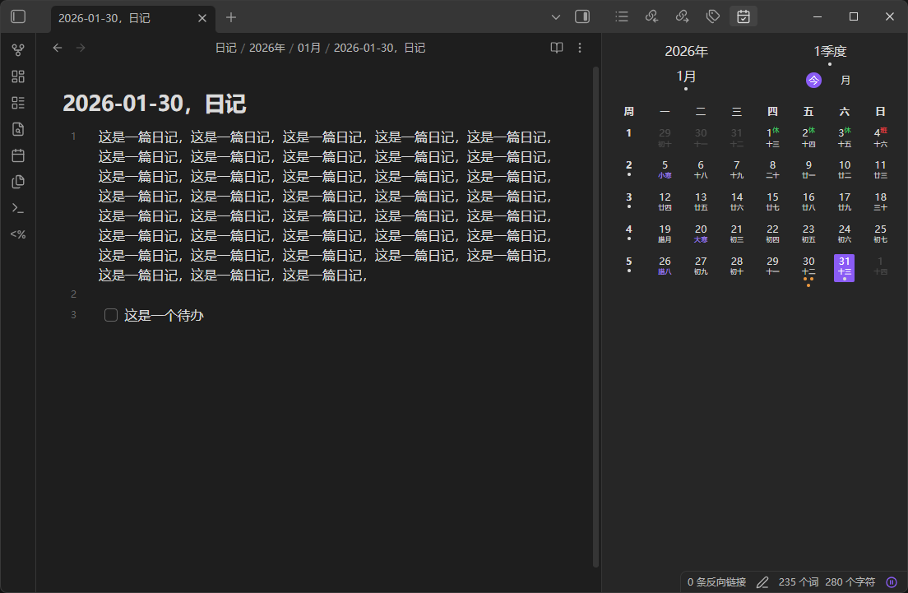

<h1 align="center">China Calendar</h1>

    
    

    China Calendar 是一款更符合中国习惯的 Obsidian 插件，它提供了日历浏览以及与日历联动的周期性笔记功能。

## 功能介绍

更符合中国习惯的日历插件，支持同时显示公历、农历、星期、节气、节假日、调休等信息，支持切换月视图和年视图，支持关联创建周期性笔记。周期性笔记包括：每日笔记、每周笔记、每月笔记、季度笔记、年度笔记。

## 下载安装

### 手动安装

1. 下载最新版本的插件（[Releases](https://github.com/TracingOrigins/obsidian-china-calendar-plugin/releases)）
2. 将插件文件夹放入你的 Obsidian 插件目录（通常为 `.obsidian/plugins/`，如 `你的库/.obsidian/plugins/china-calendar/`）
3. 在 Obsidian 设置 → 第三方插件中启用本插件

### 通过BRAT安装（推荐给测试用户）

1. 安装 [BRAT](https://github.com/TfTHacker/obsidian42-brat) 插件
2. 在 BRAT 设置中点击"添加测试插件"
3. 输入 `TracingOrigins/obsidian-china-calendar-plugin`
4. 启用插件

## 使用方法

### 日历视图

鼠标移动到日历顶部的年份区域，年份区域左右会出现切换年份的箭头，点击即可切换年份。日历顶部的月份和季度区域操作方式同理。

点击日历顶部的 `今`，可能会出现以下几种情况：

- 如果已经选中了月视图下的日期，日历视图会切换选中到当前日期；
- 如果已经选中了月视图下的周序号，日历视图会切换选中当前周序号；
- 如果已经选中了年视图下的月份，日历视图会切换选中当前月份；
- 如果已经选中了年视图下的季度序号，日历视图会切换选中当前季度序号。

点击日历顶部的 `月` 或 `年`，可以从月视图切换到年视图，或从年视图切换到月视图。

#### 字体大小

如果觉得日历界面的字体大小不合适，我们可以通过插件设置进行调整。目前共提供了三种调整模式：

- 跟随 Obsidian：日历界面的字体大小与 Obsidian 字体大小联动。如果我们开启了快速调整字体大小选项，那么可通过 Ctrl 与鼠标滚轮（或使用触摸板手势）快速调整字体大小。
- 跟随侧边栏：日历界面的字体大小与所在侧边栏的宽度联动。
- 固定大小：需要手动设置日历界面的字体大小。

#### 季度命名方式

我们可以在插件设置中调整季度命名方式，选择以 **数字** 命名或以 **春夏秋冬** 命名，这将影响日历头部季度区域和年视图中的季度名称。

### 周期性笔记

首先，我们需要在插件设置中打开对应的选项。

然后，我们需要配置周期性笔记的模板路径（包含笔记所在文件夹和笔记文件名），模板控制字符与 [luxon](https://moment.github.io/luxon/#/formatting?id=table-of-tokens) 相同。

除此之外，China Calendar 支持与一些模板插件进行联动，在创建笔记的时候自动应用模板。为了使用这项功能，我们需要选择指定一款模板插件，并为需要使用模板功能的周期性笔记配置模板文件。目前，
China Calendar 支持 Obsidian 核心插件中的模板和 [Templater](https://github.com/SilentVoid13/Templater) 。

如下展示了一个可能的配置内容：

配置完成后，按照如下方式进行操作即可创建笔记：

- 创建每日笔记：在月视图下双击日期；
- 创建每周笔记：在月视图下双击周序号；
- 创建每月笔记：在年视图下双击月份，或双击日历顶部的月份；
- 创建季度笔记：在年视图下双击季度序号，或双击日历顶部的季度；
- 创建年度笔记：双击日历顶部的年份。

当然，我们也可以通过命令创建与当前日期匹配的周期性笔记。

### 笔记信息统计

China Calendar 会统计笔记中的字数和待办，并将这些信息以小圆点或小圆孔的方式标注在与笔记关联的日历组件上。在插件设置中，允许设置多少字标注一个点以及点数上限，还可以设置待办的标注方式。

待办的标注方式有三种：

- 不标注：日历界面中不显示待办信息；
- 颜色标注：如果笔记中包含未完成的待办，用于标注笔记字数的小圆点会以一种特殊的颜色显示（默认是警告色）；
- 圆孔标注：如果笔记中包含未完成的待办，就额外标注一个小圆孔。

## 开发指南

- 克隆此仓库
- 确保你的 NodeJS 版本至少为 v16 (`node --version`)
- 使用 `npm insall` 安装依赖
- 使用 `npm run dev` 启动开发模式并进行实时编译
- 运行 `npm run build` 构建插件
- 运行 `npm run build:vault` 构建插件并将其复制到您的 vault 插件文件夹（需要在项目根目录创建一个 `.env` 文件并添加：`VAULT_PATH=/path/to/your/vault`）

## 联系和反馈

如果你在使用该插件过程中，遇到各种问题、或有什么好的建议，欢迎在 [GitHub issues](https://github.com/TracingOrigins/obsidian-china-calendar-plugin/issues) 中提出。
